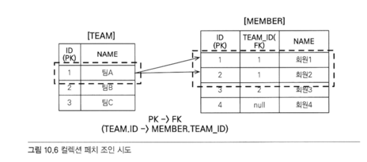
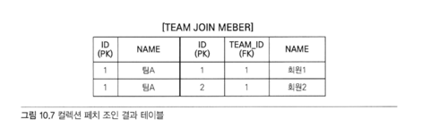
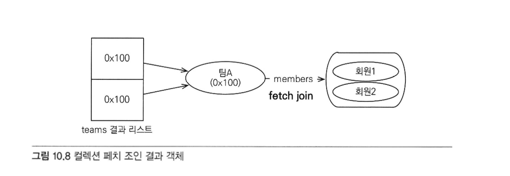
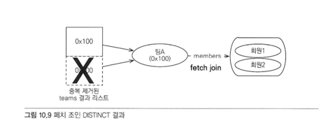

# 10.2 JPQL
어떤 방법을 사용하든 JPQL(Java Persistence Query Language)에서 모든 것이 시작.

* JPQL은 객체지향 쿼리 언어이다. 테이블 대상이 아닌 엔티티 객체를 대상.
* JPQL은 SQL을 추상화해서 특정 데이터베이스 SQL에 의존하지 않는다.
* JPQL은 결국 SQL로 변환된다.

# 10.2.1 기본 문법과 쿼리 API
SQL과 비슷하게 SELECT, UPDATE, DELETE 문을 사용할 수 있다.  
INSERT 문은 없다. -> EntityManager.persist() 메소드 사용.

```java
JPQL 문법
select_문 :: =
select_절
from_절
[where_절]
[groupby_절]
[having_절]
[orderby_절]

update_문 :: = update_절 [where_절]
delete_문 :: = delete_절 [where_절]
```

### SELECT 문 
```sql
SELECT m FROM Member AS m where m.username = 'Hello'
```

### 대소문자 구분
* 엔티티와 속성은 대소문자를 구분한다.
* SELECT, FROM, AS 같은 JPQL 키워드는 대소문자를 구분하지 않는다.

### 엔티티 이름
* JPQL에서 사용한 Member는 클래스 명이 아니라 엔티티명이다.
* 엔티티명은 `@Entity(name="xxx")`로 지정할 수 있다.
* 지정하지 않으면 클래스명이 기본값.
* 기본값인 클래스명을 엔티티명으로 사용하는 것을 추천

별칭은 필수
* JPQL은 별칭을 필수로 사용해야 한다.
* 'AS'는 생략 가능.
```sql
//잘못된 문법
SELECT username FROM Member m;   // username -> m.username으로 고쳐야 함.
```
## TypeQuery, Query
JPQL을 실행하려면 쿼리 객체를 만들어야 한다.

### 쿼리 객체
* TypeQuery
  * 반환할 타입이 명확한 경우
* Query
  * SELECT 절에서 여러 엔티티나 컬럼을 선택할 때와 같이 반환 타입이 명확하지 않은 경우
  * Select 절의 조회 대상이 둘 이상이면 `Object[]` 반환
  * Select 절의 조회 대상이 하나면 `Object`를 반환
### TypeQuery 사용
```java
TypeQuery<Member> query = em.createQuery("SELECT m FROM Member m", Member.class);

List<Member> resultList = query.getResultList();
for (Member member : resultList) {
        System.out.println("member = " + member);
}
```

### Query 사용
결과가 1개
```java
String jpql1 = "select m.username from Member m";

Query result = em.createQuery(jpql1);
List resultList = result.getResultList();

for (Object object : resultList) {
    String username = (String) object;

    System.out.println("username = " + username);
}
```

결과가 2개 이상
```java
String jpql1 = "select m.username, m.age from Member m;

Query result = em.createQuery(jpql1);
List resultList = result.getResultList();

for (Object object : resultList) {
    Object[] objects = (Object[]) object; // 결과가 둘 이상이면 Object[] 반환

    System.out.println("username = " + objects[0]);
    System.out.println("age = " + objects[1]);
}
```
타입 변환이 필요없는 `TypeQuery` 사용하는 것이 더 편리

### 결과 조회
* query.getResultList()
  * 결과가 없으면 빈 컬렉션 반환
* query.getSingleResult()
  * 결과가 정확히 하나일 때 사용.
  * 결과가 없으면 예외 발생 : NoResultException
    * 1개보다 많으면 : NonUniqueResultException
    * 결과가 정확히 1개가 아니면 예외가 발생한다는 점에 주의 필요.

# 10.2.2 파라미터 바인딩
JDBC는 위치 기준 파라미터 바인딩만 지원.  
**JPQL은 이름 기준 파라미터 바인딩도 지원**

## 이름 기준 파라미터
앞에 ":"을 사용한다.

### 이름 기준 파라미터 사용
```java
String usernameParam = "User1";

TypedQuery<Member> query = 
        em.createQuery("SELECT m FROM Member m where m.username = :username", Member.class);

query.setParameter("username", usernameParam);
List<Member> resultList = query.getResultList();
```

### 이름 기준 파라미터 메소드 체인 방식
```java
String usernameParam = "User1";

List<Member> members = 
        em.createQuery("SELECT m FROM Member m where m.username = :username", Member.class)
                .setParameter("username", usernameParam)
                .getResultList();
```


## 위치 기준 파라미터
? 다음에 위치값을 주면 된다. 위치 값은 1부터 시작.

### 위치 기준 파라미터
```java
List<Member> members = 
        em.createQuery("SELECT m FROM Member m where m.username = ?1", Member.class)
                .setParameter(1, usernameParam)
                .getResultList();
```

위치기준 파라미터 방식보다는 이름 기준 파라미터 바인딩 방식을 사용하는 것이 더 명확하다.

# 10.2.3 프로젝션
SELECT 절에 조회할 대상을 지정하는 것을 프로젝션(Projection)이라 한다.

**프로젝션 대상**
엔티티, 임베디드 타입, 스칼라 타입(숫자, 문자 등 기본 데이터)

## 엔티티 프로젝션
**조회한 엔티티는 영속성 컨텍스트에서 관리된다.**

```sql
SELECT m FROM Member m          // 멤버
SELECT m.team FROM Member.m     // 팀
```

## 임베디드 타입 프로젝션
엔티티와 거의 비슷. **조회의 시작점이 될 수 없다.**

```java
// 잘못된 쿼리
String query = "SELECT a FROM Address a";
```

```java
String query = "SELECT o.address FROM Order o";
List<Address> address = em.createQuery(query, Address.class).getResultList();
```
* **임베디드 타입은 엔티티 타입이 아닌 값 타입이다.**   
* **영속성 컨텍스트에서 관리되지 않는다.**

## 스칼라 타입 프로젝션
기본 데이터 타입들을 스칼라 타입이라 한다.

```java
List<String> usernames = 
        em.createQuery("SELECT username FROM Member m", String.class)
                .getResultList();
```

**중복제거 : DISTINCT**
```sql
SELECT DISTINCT username FROM Member m
```

**통계 쿼리 가능**
```java
Double orderAmountAvg = em.createQuery("SELECT AVG(o.orderAmount) FROM Order o", Double.class)
        .getSingleResult();
```

## 여러 값 조회
프로젝션에 여러 값을 선택하면 TypeQuery를 사용할 수 없고, 대신 Query를 사용해야 한다.

```java
Query query = em.createQuery("SELECT m.username, m.age FROM Member m");
List resultList = query.getResultList();

Iterator iterator = resultList.iterator();
while (iterator.hasNext()) {
    Object[] row = (Object[]) iterator.next();
    String username = (String) row[0];
    Integer age = (Integer) row[1];
}
```

**제너릭으로 좀 더 편하게**
조회한 엔티티는 영속성 컨텍스트에서 관리된다.

```java
List<Object[]> resultList = 
    em.createQuery("SELECT o.member, o.product, o.orderAmount FROM Order o")
    .getResultList();

for (Object[] row : resultList) {
    Member member = (Member) row[0];        //엔티티
    Product product = (Product) row[1];     //엔티티
    int orderAmount = (Integer) row[2];     //스칼라
}
```

### NEW 명령어
실제 개발에서 Object[]를 직접 사용하지 않고 DTO 형태의 의미있는 객체로 변환해서 사용.

샘플 UserDTO

```java
public class UserDTO {

    private String username;
    private int age;

    public UserDTO(String username, int age) {
        this.username = username;
        this.age = age;
    }
    // ...
}
```

### NEW 명령어 사용
NEW 명령어를 사용한 클래스로 TypeQuery를 사용할 수 있어 지루한 객체 변환 작업을 줄일 수 있다.

```java
TypeQuery<UserDTO> query = 
    em.createQuery("SELECT new jpabook.jpql.UserDTO(m.username, m.age) FROM Member m", UserDTO.class);

List<UserDTO> resultList = query.getResultList();
```

### NEW 명령어 주의 사항
1. 패키지 명을 포함한 전체 클래스 명을 입력해야 한다.
2. 순서와 타입이 일치하는 생성자가 필요한다.

# 10.2.4 페이징 API
페이징 처리용 SQL은 지루하고 반복적.

## JPA는 페이징을 두 API로 추상화
* setFirstResult(int startPosition) : 조회 시작 위치(0부터 시작)
* setMaxResults(int maxResult) : 조회할 데이터 수

## 페이징 사용
```java
TypeQuery<Member> query = em.createQuery("SELECT m FROM Member m ORDER BY m.username DESC", Member.class);

// 11번째부터 20건의 데이터 조회, 11~30    
query.setFirstResult(10);
query.setMaxResult(20);
query.getResultList();
```

# 10.2.5 집합과 정렬
집합은 집합함수와 함께 통계 정보를 구할 때 사용.

```sql
select 
    COUNT(m),       // 회원수
    SUM(m.age),     // 나이 합
    AVG(m.age),     // 나이 평균
    MAX(m.age),     // 최대 나이
    MIN(m.age),     // 최소 나이
from Member m
```

## 집합 함수 사용시 주의 사항
* NULL 값은 무시, 통계에 잡히지 않는다. (DISTINCT가 정의되어 있어도 무시된다.)
* 값이 없는데 SUM, AVG, MAX, MIN 함수를 사용하면 NULL 값이 된다. 단, COUNT는 0.
* DISTINCT를 집합 함수에 사용해서 중복된 값을 제거하고 나서 집합을 구할 수 있다.
  ```sql
  select COUNT( DISTINCT m.age) from Member m
  ```
* DISTINCT를 COUNT에 사용시 임베디드 타입은 지원하지 않는다.

## GROUP BY, HAVING
* `GROUP BY` : 특정 그룹끼리 묶어준다.
* `HAVING` : GROUP BY와 함께 사용, **GROUP BY로 그룹화한 통계 데이터를 기준으로 필터링.**

```sql
// 평균 나이가 10살 이상인 그룹을 조회
SELECT t.name, COUNT(m.age), SUM(m.age), AVG(m.age), MAX(m.age), MIN(m.age)
  FROM Member m LEFT JOIN m.team t
 GROUP BY t.name
HAVING AVG(m.age) >= 10
```

## 정렬(ORDER BY)
결과를 정렬할 때 사용한다.
```sql
select m from Member m order by m.age DESC, m.username ASC
```
* ASC : 오름차순(기본값)
* DESC : 내림차순

# 10.2.6 JPQL 조인
SQL 조인과 기능은 같고 문법만 약간 다르다.

## 내부 조인
* 내부 조인은 INNER JOIN을 사용. INNER는 생략 가능.  
* **연관 필드를 사용하여 조인.**

```java
String teamName = "팀A";
String query = "SELECT m FROM Member m INNER JOIN m.team t " 
            + "WHERE t.name = :teamName";

List<Member> members = em.createQuery(query, Member.class)
        .setParameter("teamName", teamName)
        .getResultList();
```

### Member m JOIN m.team t
회원이 가지고 있는 연관 필드로 팀과 조인한다. 조인한 팀에는 t라는 별칭을 주었다.

### 생성된 내부 조인 SQL
```sql
SELECT
  M.ID AS ID,
  M.AGE AS AGE, 
  M.TEAM_ID AS TEAM_ID, 
  M.NAME AS NAME
FROM 
  MEMBER M INNER JOIN TEAM T ON M.TEAM_ID=T.ID
WHERE T.NAME=?
```

### 잘못된 경우
  * JPQL 조인을 SQL 조인처럼 사용하면 문법 오류가 발생한다.
```sql
FROM Member m JOIN Team t   // 오류!
```

## 외부 조인
```sql
SELECT m
FROM Member m LEFT [OUTER] JOIN m.team t
```
OUTER는 생략 가능. 보통 LEFT JOIN으로 사용.

## 컬렉션 조인
일대다 관계, 다대다 관계처럼 컬렉션을 사용하는 곳에 조인.

* [회원 ->팀]으로의 조인은 다대일 조인, **단일 값 연관 필드(m.team)** 사용.
* [팀 -> 회원]은 반대로 일대다 조인, **컬렉션 값 연관 필드(m.members)** 사용.

## 세타 조인
세타 조인은 내부 조인만 지원한다.  
전혀 관계없는 엔티티도 조회할 수 있다.

### 전혀 관계없는 Member.username과 Team.name을 조인
```sql
//JPQL
select count(m) from Member m, Team t
where m.username = t.name

//SQL
SELECT COUNT(M.ID)
FROM 
    MEMBER M CROSS JOIN TEAM T
WHERE
    M.USERNAME = T.NAME
```

## JOIN ON절(JPA 2.1)
JPA 2.1부터 조인할 때 ON 절을 지원. 조인 대상을 필터링하고 조인할 수 있다.  
내부 조인의 ON 절은 WHERE절과 결과가 같음.

**보통 ON절은 외부 조인에 사용.**
```sql
//JPQL
select m, t from Member m
left join m.team t on t.name = 'A'

//SQL
SELECT m.*, t.*
FROM Member m
LEFT JOIN Team t ON m.team_id = t.id and t.name = 'A'
```

# 10.2.7 페치 조인
* 페치 조인은 SQL의 조인 종류가 아니다.  
* **JPQL에서 성능 최적화를 위해 제공하는 기능**  
* 연관된 엔티티나 컬렉션을 SQL 한번에 함께 조회하는 기능이다.  
* `join fetch` 명령어 사용  
```sql
페치 조인 ::= [ LEFT [OUTER] | INNER ] JOIN FETCH 조인경로
```

## 엔티티 페치 조인
### 회원 엔티티를 조회하면서 연관된 팀 엔티티도 함께 조회
* 일반적인 JPQL 조인과 다르게 별칭 없음.  
* m.team 다음에 별칭이 없는데, 페치 조인은 별칭을 사용할 수 없다.
```sql
select m
from Member m join fetch m.team
```

### 실행된 SQL
```sql
SELECT
    M.*, T.*
FROM MEMBER T
INNER JOIN TEAM T ON M.TEAM_ID = T.ID
```

### JPQL을 사용하는 페치 조인
```java
String jpql = "select m from Member m join fetch m.team";

List<Member> members = em.createQuery(jpql, Member.class)
        .getResultList();

for (Member member : members) {
    //페치조인으로 회원과 팀을 함께 조회 -> 지연로딩 발생 안 함.
    System.out.println("username = " + memrber.getUserName() + ", " + 
        "teamname = " + member.getTeam().name());
}
```

**회원과 팀을 지연 로딩 설정**
* 회원 조회시 페치 조인을 사용해서 팀을 함께 조회하면, 연관된 팀 엔티티는 프록시가 아닌 실제 엔티티.
* 따라서 연관된 팀을 사용해도 지연 로딩이 일어나지 않는다.
* 프록시가 아닌 실제 엔티티이므로, 회원 엔티티가 준영속 상태가 되어도 팀 조회 가능.

## 컬렉션 페치 조인
일대다 관계 (@OneToMany), 컬렉션 페치조인

```java
// JPQL
select t from Team t join fetch t.members where t.name ='팀A'
```

### SQL 쿼리 반환
```sql
SELECT T.*, M.* 
FROM TEAM T 
INNER JOIN MEMBER M ON T.ID = M.TEAM_ID 
WHERE T.NAME = '팀A'
```

### 컬렉션 페치 조인시 주의할 점
팀 A를 조회하면 DB입장에서는 일대다 관계이므로 MEMBER에 해당되는 값의 갯수만큼 반환하게 된다.
  
그림 10.6의 TEAM 테이블에서 "팀A"는 하나지만 MEMBER 테이블과 조인하면서 결과가 증가해서
  
그림 10.7의 조인 결과 테이블을 보면 같은 ‘팀A’가 2건 조회되었다.

따라서 그림 10.8의 컬렉션 페치 조인 결과 객체에서 teams 결과 예제를 보면 주소가 0x100으로 같은 "팀A"를 2건 가지게 된다.


## 페치 조인과 DISTINCT
1. 먼저 DISTINCT를 사용하면 SQL에 SELECT DISTINCT가 추가된다.   
2. 하지만 각 row의 데이터가 다르면 SQL의 DISTINCT는 효과가 없다.  
3. 다음으로 애플리케이션에서 distinct 명령어를 보고 중복된 데이터를 걸러낸다.
  


## 페치 조인과 일반 조인의 차이
* 일반 조인 실행시 연관된 엔티티를 함께 조회하지 않는다.
* **JPQL은 결과를 반환할때 연관관계를 고려하지 않는다. 단지 SELECT 절에 지정한 엔티티만 조회할 뿐이다.**

일반 조인
```sql
//JPQL
select t
from Team t join t.members m 
where t.name = '팀A'

//SQL
SELECT T.*
FROM TEAM T
INNER JOIN MEMBER M ON T.ID=M.TEAM_ID 
WHERE T.NAME = '팀A'
```

페치 조인
```sql
//JPQL
select t
from Team t join fetch t.members m 
where t.name = '팀A'

//SQL
SELECT T.*, M.* // 연관된 엔티티도 함께 조회한다.
FROM TEAM T
INNER JOIN MEMBER M ON T.ID=M.TEAM_ID 
WHERE T.NAME = '팀A'
```

## 페치 조인의 특징과 한계
**특징**  
* SQL 호출 횟수를 줄여 성능을 최적화할 수 있다.
* 페치 조인을 사용하면 연관된 엔티티를 쿼리 시점에 조회하므로 지연 로딩이 발생하지 않는다. 
* 따라서 준영속 상태에서도 객체 그래프를 탐색할 수 있다.

**한계**
1. 별칭을 줄 수 없다.  
   * 하이버네이트에는 가능하지만, 가급적 사용 X
2. 둘 이상의 컬렉션은 페치 조인 할 수 없다.  
   * 예시 ) "일대다" 의 "다" 이다. (컬렉션 + 컬렉션)
3. 컬렉션을 페치 조인하면 페이징 API (setFirstResult, setMaxResult) 를 사용할 수 없다.  
   * ( X To 다) 관계는 데이터가 뻥튀기됨  
   * 일대일, 다대일 같은 단일 값 연관 필드들은 페치 조인해도 페이징이 가능하다.  
   * 하이버네이트는 경고 로그를 남기고 메모리에서 페이징한다 (매우 위험)     
   **해결 방법**
   * : batch 사이즈를 1000이하의 숫자로 지정해 쿼리 성능을 해결할수있다.

# 10.2.8 경로 표현식
경로 표현식이란?  
.(점)을 찍어 객체 그래프를 탐색하는 것

```sql
select m.username     -- 상태 필드
from Member m
    join m.team t     -- 단일 값 연관 필드
    join m.orders o   -- 컬렉션 값 연관 필드
where t.name = '팀A'
```
m.username, m.team, m.orders, t.name 모두 경로 표현식

* **상태 필드(state field)**  
단순히 값을 저장하기 위한 필드 (ex : m.username)
* **연관 필드(association field)**  
연관관계를 위한 필드
  * 단일 값 연관 필드
    * @ManyToOne @OneToOne
    * 타겟 대상이 엔티티인 경우
  * 컬렉션 값 연관 필드
    * @OneToMany, ManyToMany
    * 타겟 대상이 컬렉션인 경우

### 상태 필드
* 경로 탐색의 끝이다.
* 그래프 탐색은 불가능하다.
  * m.username 다음에 ‘.’을 찍어서 접근이 불가능하기 때문이다.

```java
String query = "select m.username.컬럼or엔티티 From JpqlMember m";

List<String> resultList = em.createQuery(query, String.class)
        .getResultList();
```

### 단일값 연관 경로
* 묵시적 내부 조인(INNER JOIN) 발생
* 그래프 탐색이 가능하다.
* m.team 다음에 ‘.’을 찍어서 다른 상태 필드나 참조 변수에 접근이 가능.
* 묵시적 내부 조인이 발생 하도록 설계를 하면 안된다.
  * 묵시적 내부 조인은 쿼리 튜닝 역시 쉽지가 않다.
```java
// 단일 값 연관 필드
// @ManyToOne, @OneToOne 참조를 하면 탐색이 가능하고
// -> (중요) 묵시적 내부 조인이 발생한다
String query = "select m.team From JpqlMember m";

List<JpqlTeam> resultList = em.createQuery(query, JpqlTeam.class)
        .getResultList();

for (JpqlTeam team : resultList) {
        System.out.println("team = " + team);
}
```

### 컬렉션값 연관 경로
* 묵시적 내부 조인 발생
* 그래프 탐색은 불가능하다.
* FROM 절에서 명시적 조인을 통해 별칭을 얻으면 별칭을 통해 탐색 가능.
```java
String query = "select t.memberList From JpqlTeam t";

Collection resultList = em.createQuery(query, Collection.class)
                            .getResultList();
```

## 많이 하는 실수, 컬렉션 값에서 경로 탐색 시도
```sql
select t.members from Team t            //성공
select t.members.username from Team t   //실패
```

### 컬렉션에서 경로 탐색하려면?  
조인을 사용해서 새로운 별칭을 얻어야한다.
```sql
// join t.members m으로 컬렉션에 새로운 별칭을 얻음.
select m.username from Team t join t.members m
```

### SIZE라는 특별한 기능 사용
```sql
select t.members.size from Team t
```

## 명시적 조인, 묵시적 조인
### 명시적 조인
join 키워드를 직접 사용하는것
```sql
select m from Member m join m.team t
```

### 묵시적 조인
경로 표현식 (."점")을 사용해 묵시적으로 SQL 조인이 발생하는것
```sql
select m.team from Member m
```


# 10.2.9 서브쿼리
SQL처럼 서브 쿼리를 지원한다.

나이가 평균보다 많은 회원
```sql
select m from Member m
where m.age > (select avg(m2.age) from Member m2)
```

한 건이라도 주문한 고객
```sql
select m from Member m
where (select count(o) from Order o where m = o.member) > 0
```


# 10.2.10 조건식
## 타입표현

| 종류        | 예제                          |
|-------------|-------------------------------|
| 문자        | 'HELLO', 'Hi'                 |
| 숫자        | 10L, 10D, 10F                 |
| 날짜        | {d'2012-03-24'}               |
| 타임        | {t'10-11-11'}                 |
| DATETIME    | [ts'2014-03-24 10-11-11.123'] |
| Enum        | jpabook.MemberType.Admin      |
| 엔티티 타입  | TYPE(m) = Member              |


## Between, IN, Like, Null
### Between
```sql
select m from Member m
where m.age between 10 and 20
```

### IN 식
```sql
select m from Member m
where m.username in ('회원1', '회원2')
```

### Like 식
```sql
// 중간에 '원'이 들어간 회원
select m from Member m
where m.username like '%원%'

where m.username like '회원%'

where m.username like '%회원'

//회원A, 회원1
where m.username like '회원_'

//회원3
where m.username like '__3'
```

### NULL 비교식
```sql
where m.username is null
where null = null       //거짓
where 1 = 1             //참
```

## 컬렉션 식
컬렉션은 컬렉션 식 이외에 다른 식을 사용할 수 없다.

### 빈 컬렉션 비교
```sql
//JPQL : 주문이 하나라도 있는 회원 조회
select m from Member m
where m.orders is not empty
```
### 컬렉션 식이 아닌 경우
```sql
select m from Member m
where m.orders is null      //오류
```

### 컬렉션 멤버 식
문법: [NOT] MEMBER [OF] 컬렉션 값 연관 경우
설명: 엔티티나 값이 컬렉션에 포함되어 있으면 참
```sql
select t from Team t
where :memberParam member of t.members
```

## 스칼라식
숫자, 문자, 날짜, case, 엔티티 타입같은 기본적인 값

### 날짜함수
* CURRENT_DATE : 현재 날짜
* CURRENT_TIME : 현재 시간
* CURRENT_TIMESTAMP : 현재 날짜 시간

## CASE 식
특정 조건에 따라 분기할 때 CASE식 사용

**기본 CASE**
```sql
select 
    case when m.age <= 10 then '학생요금'
        when m.age >= 60 then '경로요금'
        else '일반요금'
    end
from Member m
```
**심플 CASE**
자바의 switch case문과 비슷
```sql
select
    case t.name
        when '팀A' then '인센티브 110%'
        when '팀B' then '인센티브 120%'
        else '인센티브 105%'
    end
from Team t
```
**COALESCE**  
스칼라식을 차례대로 조회해서 null이 아니면 반환
```sql
// m.username이 null이면 '이름없는 회원`을 반환
select coalesce(m.username, '이름없는 회원') from Member m
```
**NULLIF**  
두 값이 같으면 null 반환, 다르면 첫번째 값. 보통 집합 합수에 사용.
```sql
select NULLIF(m.username, '관리자') from Member m
```

# 10.2.11 다형성쿼리
부모 엔티티를 조회하면 그 자식 엔티티도 함께 조회한다.

## TYPE
TYPE은 엔티티의 상속 구조에서 조회 대상을 특정 자식 타입으로 한정할 때 주로 사용한다.  

Item 중에 Book, Movie를 조회하라.
```sql
//JPQL
select i from Item i
where type(i) IN (Book, Movie)

// SQL
SELECT i FROM Item i 
WHERE i.DTYPE in('B', 'M')
```

## TREAT(JPA 2.1)
JPQL을 보면 treat를 사용해서 부모 타입인 Item을 자식 타입인 Book으로 다룬다. 
따라서 author 필드에 접근할 수 있다.
```sql
//JPQL
select i from Item i 
where treat(i as Book).author= 'kim'

//SQL
select i,* from Item i 
where
  i.DTYPE='B'
  and i.author='kim'
```


# 10.2.12 사용자 정의 함수 호출 

# 10.2.13 기타 정리
* enum은 == 비교 연산만 지원
* 임베디드 타입은 비교를 지원하지 않는다.

# 10.2.14 엔티티 직접 사용
JPQL에서 엔티티를 직접 사용하면 SQL에서 해당 엔티티의 기본 키값을 사용한다.

```java
//JPQL
select count(m.id) from Member m // 엔티티의 아이디를 사용
select count(m) from Member m // 엔티티를 직접사용
```

```sql
// 둘다 같은 SQL을 실행한다
select count(m.id) as cnt from Member m (엔티티의 pk값을 기본값으로 한다)
```


# 10.2.15 Named 쿼리: 정적 쿼리 
어플리케이션 로딩 시점에 JPQL 문법을 체크하고 미리 파싱해준다.  
오류를 빨리 확인할 수 있고, 사용하는 시점에는 파싱된 결과를 재사용.  
성능상 이점.  
@NamedQuery 어노케이션이나 XML에 작성 가능

### Named 쿼리를 어노테이션에 정의
정의
```java
@Entity 
@NamedQuery(
    name = "Member.findByUsername",
    query = "select m from Member m where m.username = :username")
public class Member {
    ...
}
```
사용
```java
List<Member> resultList = em.createNamedQuery("Member.findByUsername", Member.class)
            .setParameter("username", "회원1")
            .getResultList();
```
### 2개 이상 정의 
@NamedQueries 어노테이션 사용
```java
@Entity 
@NamedQueries({
    @NamedQuery(
        name = "Member.findByUsername",
        query = "select m from Member m where m.username = :username"),
    @NamedQuery(
        name = "Member.count"
        query = "select count(m) from Member m")
})
public class Member { ... }
```